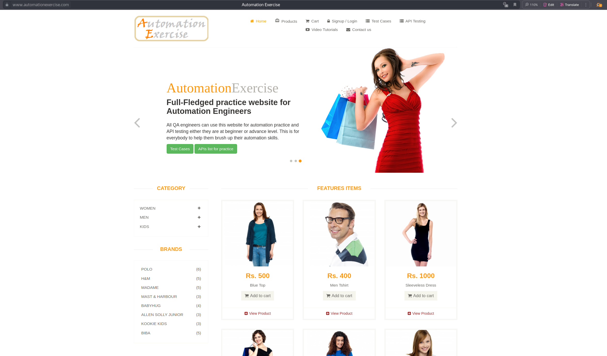
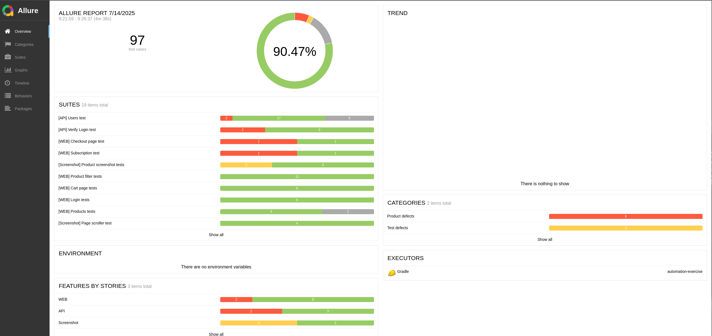
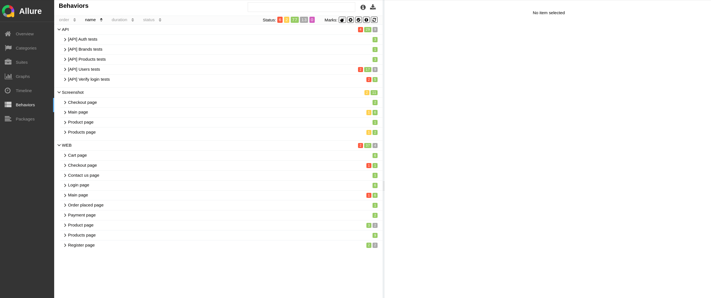
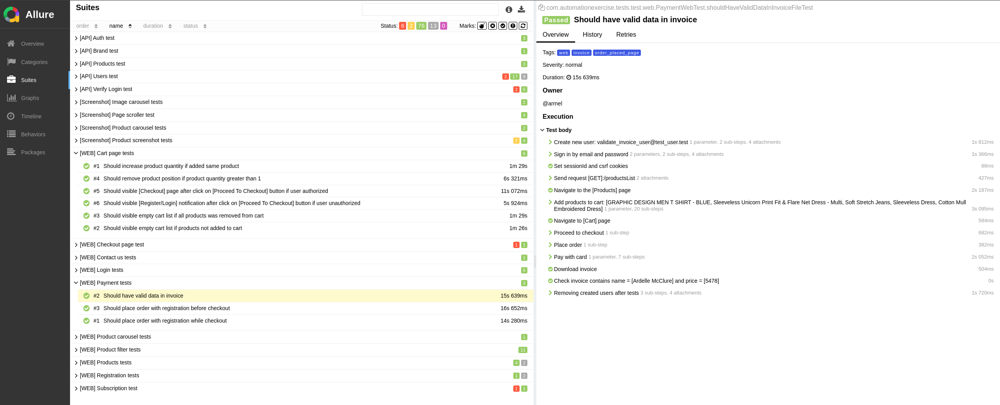
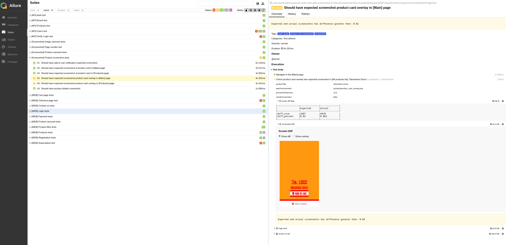
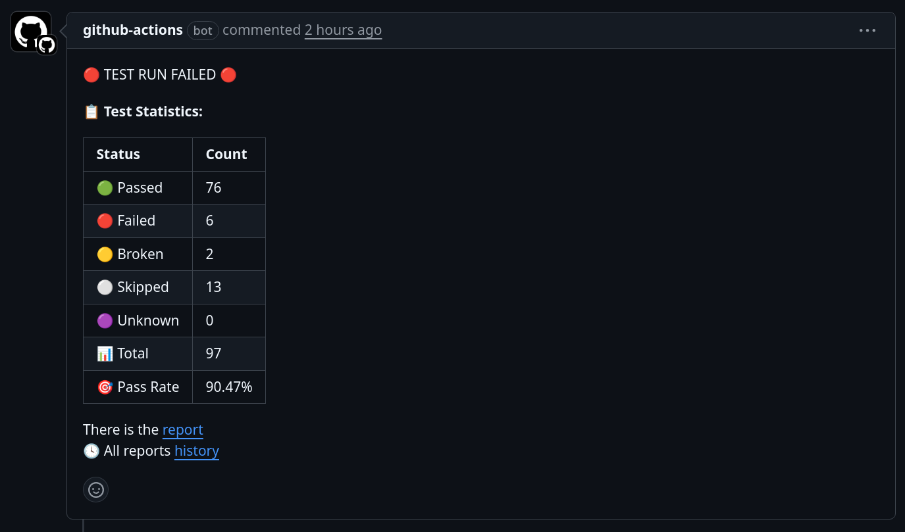

# AutomationExercise. Java 21 + RestAssured + Playwright

## Оглавление

* [Описание проекта](#описание-проекта)
* [Использованные технологии](#используемые-технологии)
* [Используемые переменные окружения](#используемые-переменные-окружения)
* [Важная информация](#важная-информация)
* [Запуск тестов в IDE](#запуск-тестов-в-ide)
* [Запуск тестов в локальной среде](#запуск-тестов-в-локальной-среде)
* [Запуск тестов в Docker](#запуск-тестов-в-docker)
* [Запуск тестов в Minikube + Moon](#запуск-тестов-в-minikube--moon)
* [Образец отчёта о тестировании](#образец-отчёта-о-тестировании)

## Описание проекта

Тестовый интернет-магазин с базовой функциональностью — каталог товаров, карточки товаров, поиск, фильтры, корзина,
оформление заказа, регистрация/логин, формы обратной связи и прочее.



## Используемые технологии

- [RestAssured](https://rest-assured.io/docs)
- [Playwright Java](https://playwright.dev/java/docs/api/class-playwright)
- [JUnit 5 (Extensions, Resolvers, etc)](https://junit.org/junit5/docs/current/user-guide/)
- [Java 21](https://adoptium.net/en-GB/temurin/releases/)
- [Gradle 8.8](https://docs.gradle.org/current/userguide/userguide.html)
- [Allure 2](https://docs.qameta.io/allure/)
- [Allure Docker Service](https://github.com/fescobar/allure-docker-service)
- [Docker](https://www.docker.com/resources/what-container/)
- [Docker-compose](https://docs.docker.com/compose/)
- [Dockerfile](https://docs.docker.com/reference/dockerfile/)

## Используемые переменные окружения

| Ключ                         | Обязателен | Значение по-умолчанию | Описание                                                                                                                                                                                                                                             |
|------------------------------|------------|-----------------------|------------------------------------------------------------------------------------------------------------------------------------------------------------------------------------------------------------------------------------------------------|
| DISPLAY                      | +          | :0                    | Значение переменной окружения ${DISPLAY} на хосте. Необходим в окружениях "docker" и "ci"                                                                                                                                                            |
| TEST_ENV                     |            | docker                | Окружение запуска тестов. Доступные значения: local, docker, ci                                                                                                                                                                                      |
| TEST_DEFAULT_USER_PASSWORD   |            | 12345                 | Пароль по умолчанию при регистрации пользователей                                                                                                                                                                                                    |
| TEST_MAX_SCREENSHOT_DIFF     |            | 0.2                   | Максимальный процент отклонения скриншотов который можно указывать в тестах                                                                                                                                                                          |
| TEST_SAVE_FAILED_TESTS_VIDEO |            | false                 | Нужно ли сохранять видео упавших тестов                                                                                                                                                                                                              |
| TEST_REST_LOGS               |            | headers               | Уровень логирования RestAssured                                                                                                                                                                                                                      |
| TEST_REWRITE_ALL_SCREENSHOTS |            | false                 | Переписать ожидаемые скриншоты                                                                                                                                                                                                                       |
| PLAYWRIGHT_BROWSER_NAME      |            | chromium              | Браузер. Возможные значения: chromium, firefox, webkit(safari)                                                                                                                                                                                       |
| PLAYWRIGHT_BROWSER_TIMEOUT   |            | 10000.0               | Неявное ожидаение                                                                                                                                                                                                                                    |
| PLAYWRIGHT_HEADLESS          |            | false                 | Запуск браузера в режиме headless                                                                                                                                                                                                                    |
| PLAYWRIGHT_SLOW_MOTION       |            | 50.0                  | Необходим для замедления выполнения тестов                                                                                                                                                                                                           |
| GITHUB_TOKEN                 | +          |                       | Fine-grained PAT-токен. Создать по [ссылке](https://github.com/settings/personal-access-tokens) или перейти в Settings -> Developer Settings -> Personal access tokens -> Fine-grained tokens.<br/><br/> ***Необходимые права: Issues (read-only)*** |
| GITHUB_TOKEN_NAME            | +          |                       | Название Fine-grained PAT-токена                                                                                                                                                                                                                     |
| GITHUB_ACCOUNT_NAME          | +          |                       | Имя профиля репозитория в github. Если делали форк репозитория то нужно указать имя аккаунта.                                                                                                                                                        |
| GITHUB_REPO_NAME             | +          |                       | Имя репозитория в github. Если делали форк репозитория то нужно указать имя аккаунта.                                                                                                                                                                |

## Важная информация

### Информация о необходимых действиях перед запуском

1) Чтобы тесты на скриншоты работали нужно перейти в `src/.screen-output/screenshots/remote` и сделать 2 копии данной
   папки с именами `local` и `docker`.
2) При первом запуске в окружениях `local` и `docker` укажите переменную окружения `TEST_REWRITE_ALL_SCREENSHOTS=true`,
   для перезаписи ожидаемых скриншотов.

### Информация о возможных ошибках в тестах:

3) Github имеет ограничение количества отправляемых запросов в час. Поэтому могут быть ситуации когда возвращается 403
   статус код, при получении информации об issue. Данная проблема может наблюдаться, если включен VPN.
   Подробнее по ссылке: [тут](https://docs.github.com/rest/overview/rate-limits-for-the-rest-api)

4) Пользователи, email которых указаны в аннотациях **@User**, **@Users** и **@ApiLogin**, могут уже существовать. Перед
   запуском тестов нужно убедиться, что пользователи с такими email не зарегистрированы и при наличии удалить их, либо
   использовать другие email. Иначе, будут падать тесты, при попытке создания пользователя. Так как, запрос на получение
   пользователя не возвращает полной информации о пользователе, данные пользователи не могуть быть использованы в
   тестах.

### Комментарий

5) При составлении тестов, считалось что все поля имеют валидацию как на фронте, так и бэкэнде. По факту валидация полей
   отсутствует. За исключением момента с валидацией полей на их наличие, при отправке запроса на создания пользователя.
   Поэтому часть тестов помечена аннотацией @DisabledByIssue, которая пропускает тесты, если issue с таким id открыт.

## Запуск тестов в IDE

**При первом запуске тестов, выполните п.1 и п.2 из [Важная информация](#важная-информация)**

1) Открыть проект;
2) Добавить в конфигурацию запуска тестов необходимые переменные окружения;
3) Запутить тесты.
4) После прохождения тестов смотрим можно посмотреть Allure отчёт командой: `./gradlew allureServe`

## Запуск тестов в локальной среде

**При первом запуске тестов, выполните п.1 и п.2 из [Важная информация](#важная-информация)**

1) Добавить необходимые переменные окружения;
2) Перейти в директорию с тестами;
3) Запустить тесты командой: `./gradlew clean test`
4) После прохождения тестов смотрим можно посмотреть Allure отчёт командой: `./gradlew allureServe`

## Запуск тестов в Docker

**При первом запуске тестов, выполните п.1 и п.2 из [Важная информация](#важная-информация)**

1) Добавить необходимые переменные окружения;
2) Перейти в директорию с тестами;
3) Собрать изображение с тестами;

```
docker build \
          --build-arg DISPLAY=${DISPLAY} \
          --build-arg PLAYWRIGHT_VERSION="1.53.0" \
          -t automation-exercise-tests \
          .
```

4) Запуск контейнера с тестами; `docker compose up -d`  

5) После прохождения тестов смотрим можно посмотреть Allure отчёт командой: `./gradlew allureServe`

## Запуск тестов в Minikube + Moon

В процессе работы

## Образец отчёта о тестировании










